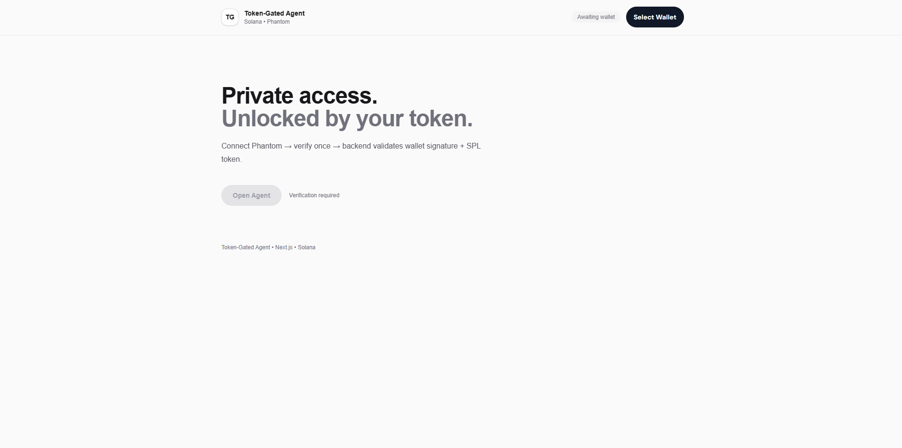

# Token-Gated Agent ⚡

Minimal SPL token-gated AI access control built on Solana.

## Live

https://token-gated-agent.vercel.app/

---

## Preview



---

## Overview

Token-Gated Agent is a minimal access control layer that verifies SPL token ownership before granting AI access.

Users connect their wallet.
Sign a challenge.
If token balance ≥ 1 → access granted.

No staking.
No custody.
No unnecessary complexity.

---

## How It Works

1. User connects Phantom wallet
2. User signs a secure message
3. App checks SPL token balance on-chain
4. Access granted if balance requirement is met

Flow:

Client → Wallet signature → On-chain token check → Access decision → AI interface

---

## Features

- SPL token ownership verification
- Wallet-based authentication
- Signature-based login (no transactions required)
- Minimal attack surface
- Clean UI
- Stateless access logic

---

## Stack

- Next.js
- TypeScript
- Solana Web3.js
- OpenAI
- Vercel

---

## Use Case

Designed for:

- DAO access control
- Research communities
- Token-based communities
- Gated AI endpoints

Ownership proves access.
Nothing else.

---

## Status

Live and production-ready.

---

## Run Locally

```bash
npm install
npm run dev
